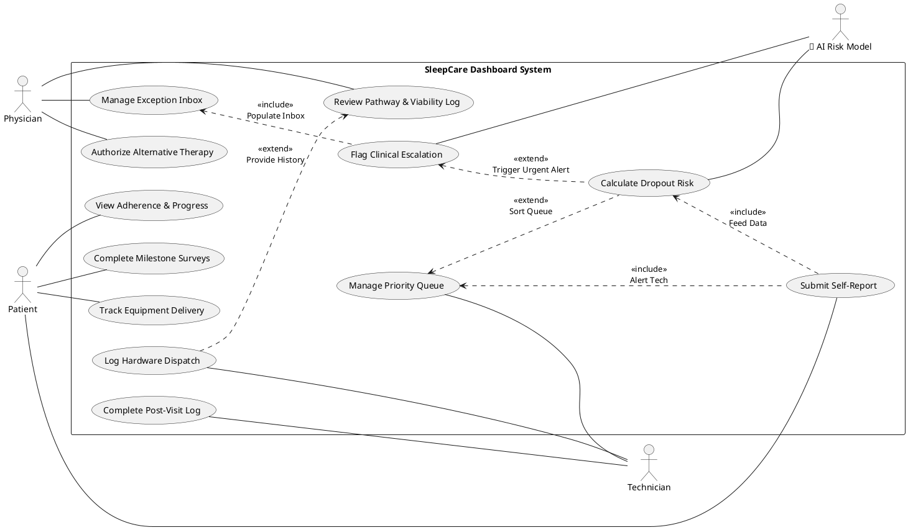
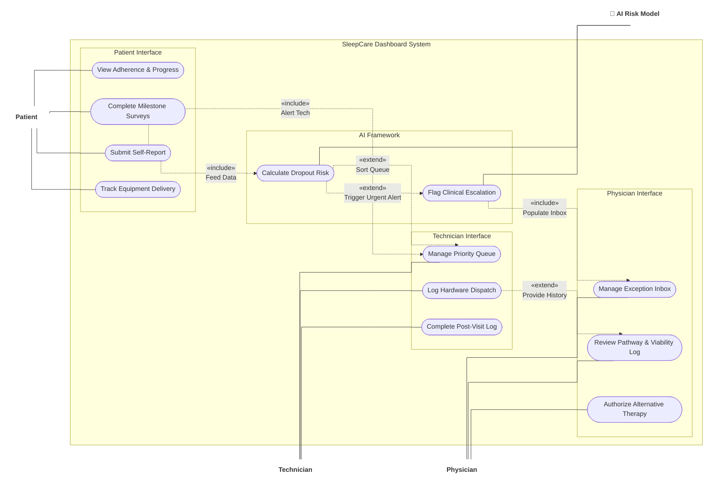

# SleepCare Ecosystem: Use Case Diagram

### 1. The Classical UML Standard (PlantUML)
*Your screenshot reveals exactly why PlantUML was failing: the internal "Packages" (Subgraphs) were acting as solid walls. The PlantUML Graphviz engine refuses to draw lines through packages, so it was forced to route all the dotted dependencies out the side door, around the entire system boundary, and back in! I have stripped the internal packages so the Use Cases are free-floating inside the system. The engine will now instantly clump them together based on their connections and route the dependencies flawlessly through the center.*

---

### 2. The Strict-Linear Fallback (Mermaid)

