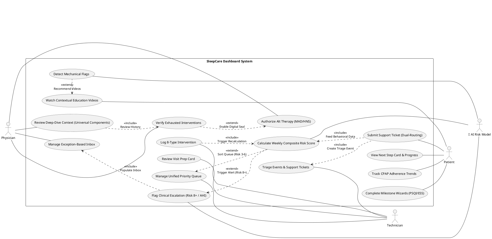
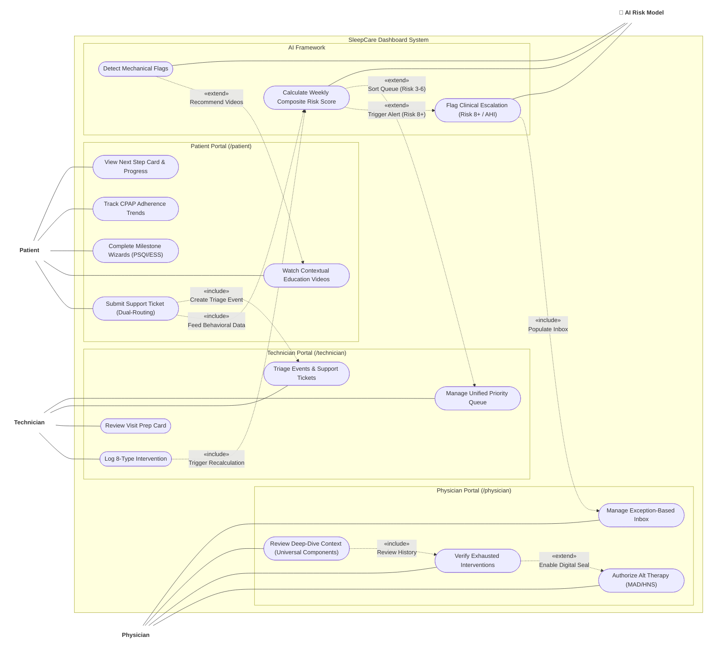

# SleepCare Ecosystem: Use Case Diagram

### 1. The Classical UML Standard (PlantUML)
*Use Cases are grouped with `together` blocks for visual clustering without hard package boundaries. This lets the Graphviz engine route dependency lines cleanly through the centre of the system rectangle.*

```plantuml
@startuml
left to right direction
skinparam packageStyle rectangle
skinparam nodesep 30
skinparam ranksep 60

actor Patient
actor Physician
actor Technician
actor "🧠 AI Risk Model" as AI

' ── Force vertical spacing between actors ──
Technician -[hidden]down- Patient
Patient -[hidden]down- AI

rectangle "SleepCare Dashboard System" {

  together {
    usecase "View Next Step Card & Progress" as UC_NextStep
    usecase "Track CPAP Adherence Trends" as UC_Adherence
    usecase "Complete Milestone Wizards (PSQI/ESS)" as UC_Milestone
    usecase "Watch Contextual Education Videos" as UC_Video
    usecase "Submit Support Ticket (Dual-Routing)" as UC_Report
  }

  together {
    usecase "Manage Exception-Based Inbox" as UC_Inbox
    usecase "Review Deep-Dive Context (Universal Components)" as UC_DeepDive
    usecase "Verify Exhausted Interventions" as UC_VerifyInt
    usecase "Authorize Alt Therapy (MAD/HNS)" as UC_Auth
  }

  together {
    usecase "Manage Unified Priority Queue" as UC_Queue
    usecase "Triage Events & Support Tickets" as UC_Triage
    usecase "Review Visit Prep Card" as UC_Prep
    usecase "Log 8-Type Intervention" as UC_Intervention
  }

  together {
    usecase "Calculate Weekly Composite Risk Score" as UC_CalcRisk
    usecase "Detect Mechanical Flags" as UC_DetectMech
    usecase "Flag Clinical Escalation (Risk 8+ / AHI)" as UC_FlagEsc
  }
}

' ── Actor on the Left ──
Physician -- UC_Inbox
Physician -- UC_DeepDive
Physician -- UC_VerifyInt
Physician -- UC_Auth

' ── Actors on the Right ──
UC_NextStep -- Patient
UC_Adherence -- Patient
UC_Milestone -- Patient
UC_Video -- Patient
UC_Report -- Patient

UC_Queue -- Technician
UC_Triage -- Technician
UC_Prep -- Technician
UC_Intervention -- Technician

UC_CalcRisk -- AI
UC_DetectMech -- AI
UC_FlagEsc -- AI

' ── Internal Logical Dependencies ──
UC_Report .up.> UC_Triage : <<include>>\nCreate Triage Event
UC_Report .up.> UC_CalcRisk : <<include>>\nFeed Behavioral Data

UC_DetectMech .left.> UC_Video : <<extend>>\nRecommend Videos

UC_CalcRisk .up.> UC_Queue : <<extend>>\nSort Queue (Risk 3-6)
UC_CalcRisk .up.> UC_FlagEsc : <<extend>>\nTrigger Alert (Risk 8+)

UC_FlagEsc .up.> UC_Inbox : <<include>>\nPopulate Inbox

UC_Intervention .down.> UC_CalcRisk : <<include>>\nTrigger Recalculation

UC_DeepDive .down.> UC_VerifyInt : <<include>>\nReview History
UC_VerifyInt .down.> UC_Auth : <<extend>>\nEnable Digital Seal
@enduml
```

---

### 2. The Strict-Linear Fallback (Mermaid)

```mermaid
%%{init: {'flowchart': {'curve': 'basis'}}}%%
flowchart LR
    Patient["Patient"]
    Tech["Technician"]
    Physician["Physician"]
    AI["🧠 AI Risk Model"]

    classDef actor fill:none,stroke:none,text-align:center,font-weight:bold;
    class Patient,Tech,Physician,AI actor;

    subgraph SleepCare["SleepCare Dashboard System"]
        direction TB
        
        subgraph Pat_UI["Patient Portal (/patient)"]
            UC_NextStep(["View Next Step Card & Progress"])
            UC_Adherence(["Track CPAP Adherence Trends"])
            UC_Milestone(["Complete Milestone Wizards (PSQI/ESS)"])
            UC_Video(["Watch Contextual Education Videos"])
            UC_Report(["Submit Support Ticket (Dual-Routing)"])
        end
        
        subgraph Tech_UI["Technician Portal (/technician)"]
            UC_Queue(["Manage Unified Priority Queue"])
            UC_Triage(["Triage Events & Support Tickets"])
            UC_Prep(["Review Visit Prep Card"])
            UC_Intervention(["Log 8-Type Intervention"])
        end

        subgraph Doc_UI["Physician Portal (/physician)"]
            UC_Inbox(["Manage Exception-Based Inbox"])
            UC_DeepDive(["Review Deep-Dive Context (Universal Components)"])
            UC_VerifyInt(["Verify Exhausted Interventions"])
            UC_Auth(["Authorize Alt Therapy (MAD/HNS)"])
        end

        subgraph AI_UI["AI Framework"]
            UC_CalcRisk(["Calculate Weekly Composite Risk Score"])
            UC_DetectMech(["Detect Mechanical Flags"])
            UC_FlagEsc(["Flag Clinical Escalation (Risk 8+ / AHI)"])
        end
    end

    Patient --- UC_NextStep
    Patient --- UC_Adherence
    Patient --- UC_Milestone
    Patient --- UC_Video
    Patient --- UC_Report

    Tech --- UC_Queue
    Tech --- UC_Triage
    Tech --- UC_Prep
    Tech --- UC_Intervention

    Physician --- UC_Inbox
    Physician --- UC_DeepDive
    Physician --- UC_VerifyInt
    Physician --- UC_Auth

    UC_CalcRisk --- AI
    UC_DetectMech --- AI
    UC_FlagEsc --- AI

    UC_Report -. "&laquo;include&raquo;<br/>Create Triage Event" .-> UC_Triage
    UC_Report -. "&laquo;include&raquo;<br/>Feed Behavioral Data" .-> UC_CalcRisk
    
    UC_DetectMech -. "&laquo;extend&raquo;<br/>Recommend Videos" .-> UC_Video
    
    UC_CalcRisk -. "&laquo;extend&raquo;<br/>Sort Queue (Risk 3-6)" .-> UC_Queue
    UC_CalcRisk -. "&laquo;extend&raquo;<br/>Trigger Alert (Risk 8+)" .-> UC_FlagEsc
    
    UC_FlagEsc -. "&laquo;include&raquo;<br/>Populate Inbox" .-> UC_Inbox
    
    UC_Intervention -. "&laquo;include&raquo;<br/>Trigger Recalculation" .-> UC_CalcRisk
    
    UC_DeepDive -. "&laquo;include&raquo;<br/>Review History" .-> UC_VerifyInt
    UC_VerifyInt -. "&laquo;extend&raquo;<br/>Enable Digital Seal" .-> UC_Auth
```
