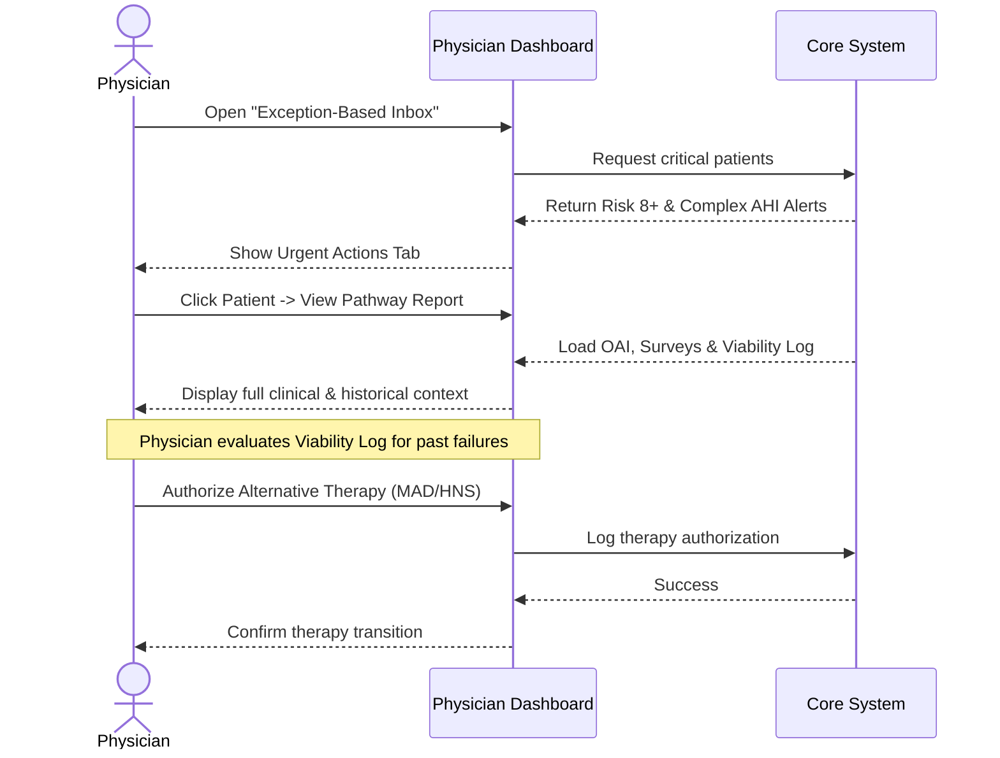
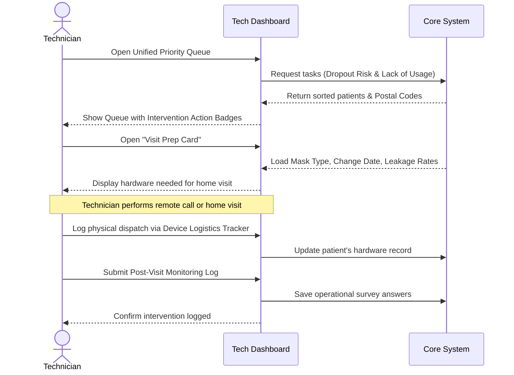
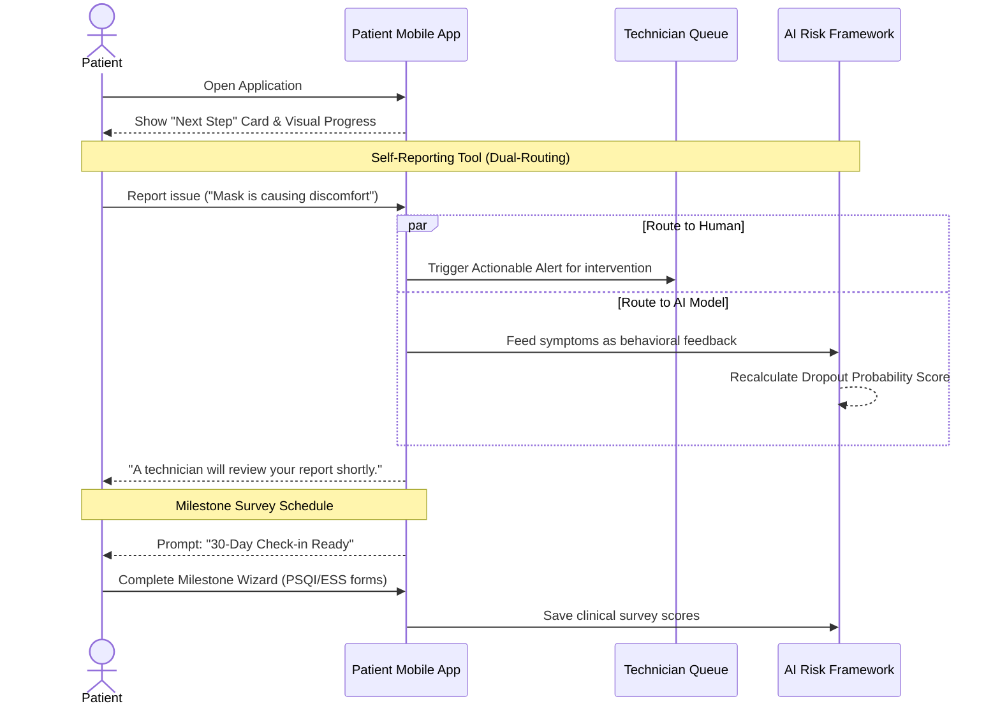

# Frontend Architecture: Clinical Stakeholder Diagrams

### 1. The Physician View
*Focuses on the clear flow from the Exception Inbox to authorizing an alternative therapy.*

### 2. The Technician View
*Focuses on the tactical workflow of reviewing the queue, prepping for a visit, and logging hardware.*

### 3. The Patient View (Dual-Routing Focus)
*Clearly illustrates how the patient's self-reported issues feed both the human tech and the AI without overwhelming the reader.*

---

