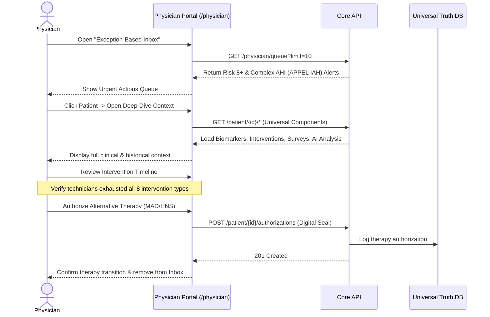
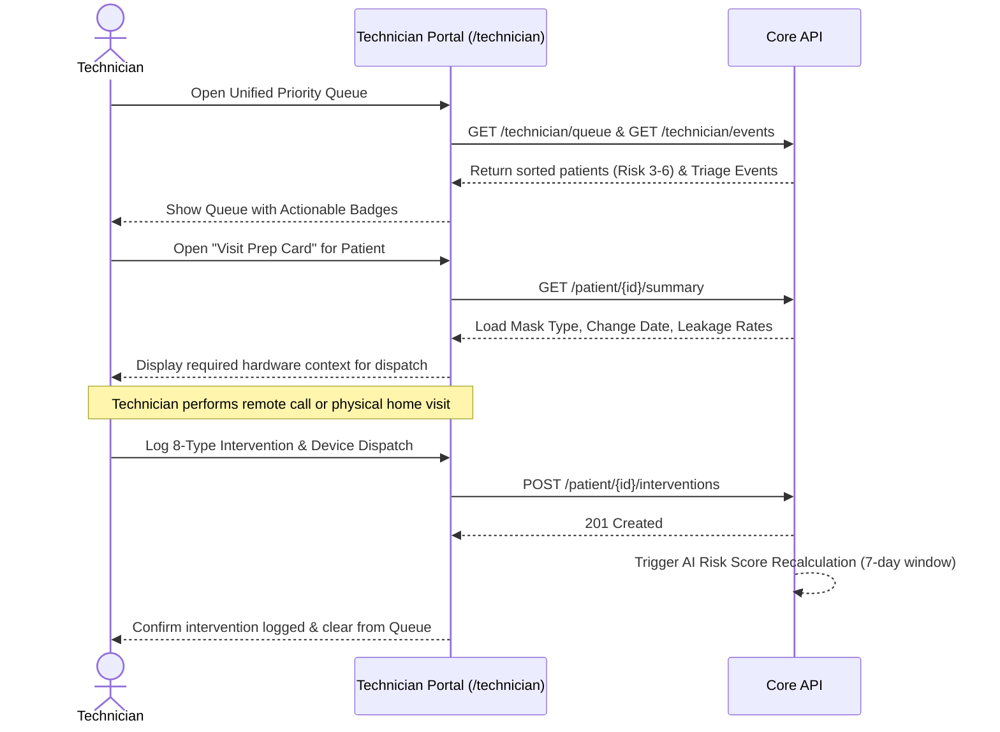
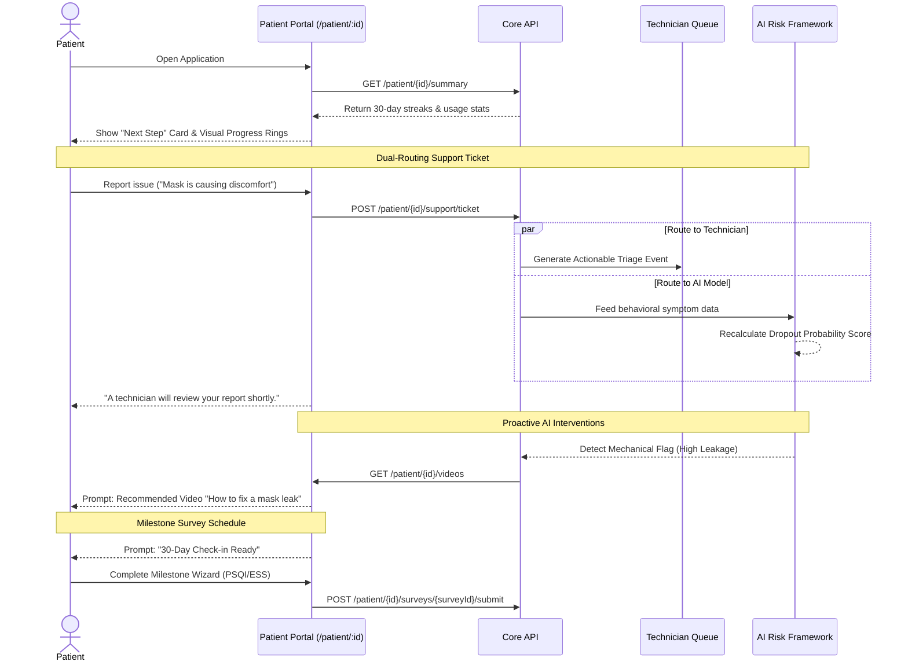

# Frontend Architecture: Clinical Stakeholder Diagrams

### 1. The Physician View
*Focuses on the clear flow from the Exception Inbox to authorizing an alternative therapy, ensuring all 8 interventions have been exhausted.*

```mermaid
sequenceDiagram
    actor Physician
    participant Dashboard as Physician Portal (/physician)
    participant System as Core API
    participant DB as Universal Truth DB

    Physician->>Dashboard: Open "Exception-Based Inbox"
    Dashboard->>System: GET /physician/queue?limit=10
    System-->>Dashboard: Return Risk 8+ & Complex AHI (APPEL IAH) Alerts
    Dashboard-->>Physician: Show Urgent Actions Queue

    Physician->>Dashboard: Click Patient -> Open Deep-Dive Context
    Dashboard->>System: GET /patient/{id}/* (Universal Components)
    System-->>Dashboard: Load Biomarkers, Interventions, Surveys, AI Analysis
    Dashboard-->>Physician: Display full clinical & historical context

    Physician->>Dashboard: Review Intervention Timeline
    Note over Physician, Dashboard: Verify technicians exhausted all 8 intervention types
    
    Physician->>Dashboard: Authorize Alternative Therapy (MAD/HNS)
    Dashboard->>System: POST /patient/{id}/authorizations (Digital Seal)
    System->>DB: Log therapy authorization
    System-->>Dashboard: 201 Created
    Dashboard-->>Physician: Confirm therapy transition & remove from Inbox
```

### 2. The Technician View
*Focuses on the tactical workflow of reviewing the unified priority queue, managing inventory, and logging the 8-type taxonomy interventions.*

```mermaid
sequenceDiagram
    actor Technician
    participant Dashboard as Technician Portal (/technician)
    participant System as Core API

    Technician->>Dashboard: Open Unified Priority Queue
    Dashboard->>System: GET /technician/queue & GET /technician/events
    System-->>Dashboard: Return sorted patients (Risk 3-6) & Triage Events
    Dashboard-->>Technician: Show Queue with Actionable Badges

    Technician->>Dashboard: Open "Visit Prep Card" for Patient
    Dashboard->>System: GET /patient/{id}/summary
    System-->>Dashboard: Load Mask Type, Change Date, Leakage Rates
    Dashboard-->>Technician: Display required hardware context for dispatch

    Note over Technician, Dashboard: Technician performs remote call or physical home visit
    
    Technician->>Dashboard: Log 8-Type Intervention & Device Dispatch
    Dashboard->>System: POST /patient/{id}/interventions
    System-->>Dashboard: 201 Created
    
    System-->>System: Trigger AI Risk Score Recalculation (7-day window)
    Dashboard-->>Technician: Confirm intervention logged & clear from Queue
```

### 3. The Patient View (Dual-Routing Focus)
*Clearly illustrates how the patient's self-reported issues feed both the human tech queue and the AI model, along with automated video recommendations.*

```mermaid
sequenceDiagram
    actor Patient
    participant App as Patient Portal (/patient/:id)
    participant System as Core API
    participant TechQueue as Technician Queue
    participant AI as AI Risk Framework

    Patient->>App: Open Application
    App->>System: GET /patient/{id}/summary
    System-->>App: Return 30-day streaks & usage stats
    App-->>Patient: Show "Next Step" Card & Visual Progress Rings

    Note over Patient, AI: Dual-Routing Support Ticket
    Patient->>App: Report issue ("Mask is causing discomfort")
    App->>System: POST /patient/{id}/support/ticket
    
    par Route to Technician
        System->>TechQueue: Generate Actionable Triage Event
    and Route to AI Model
        System->>AI: Feed behavioral symptom data
        AI-->>AI: Recalculate Dropout Probability Score
    end

    App-->>Patient: "A technician will review your report shortly."

    Note over AI, App: Proactive AI Interventions
    AI-->>System: Detect Mechanical Flag (High Leakage)
    System->>App: GET /patient/{id}/videos
    App-->>Patient: Prompt: Recommended Video "How to fix a mask leak"

    Note over Patient, App: Milestone Survey Schedule
    App-->>Patient: Prompt: "30-Day Check-in Ready"
    Patient->>App: Complete Milestone Wizard (PSQI/ESS)
    App->>System: POST /patient/{id}/surveys/{surveyId}/submit
```
