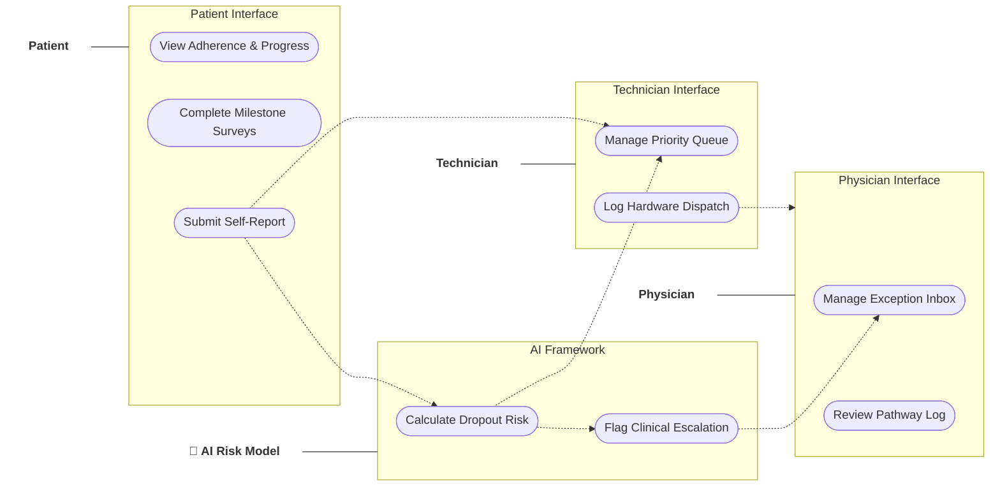
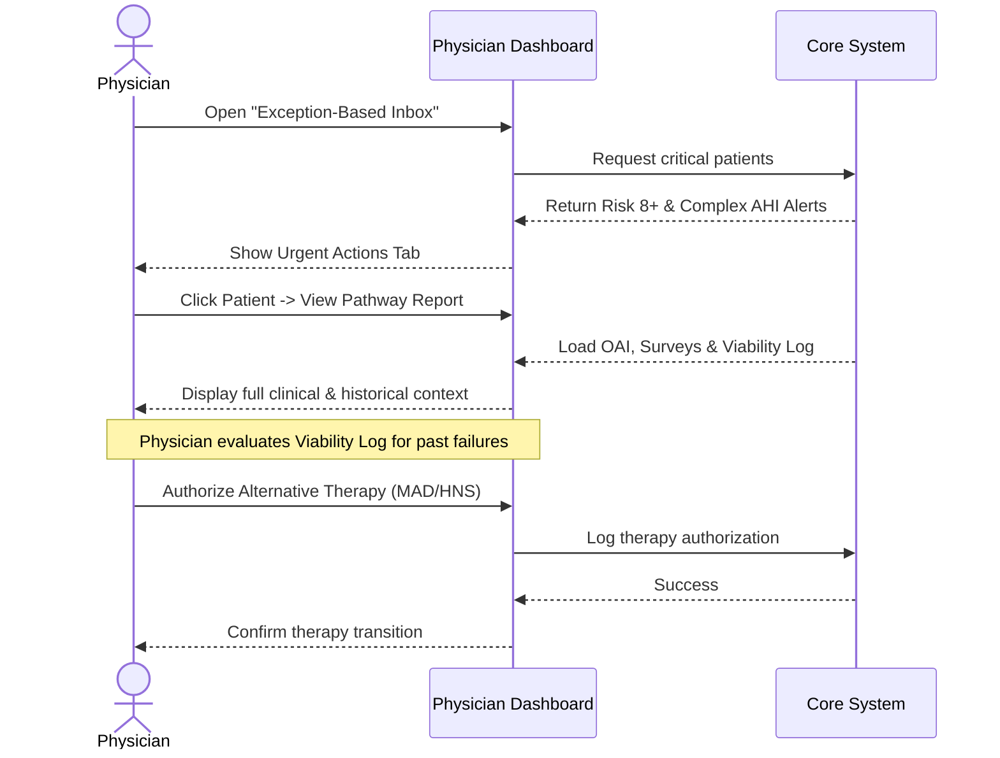
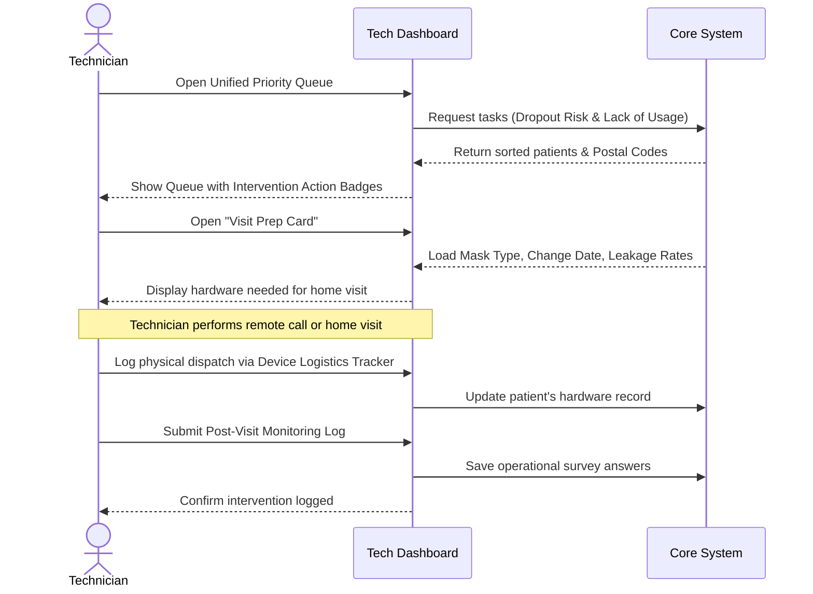
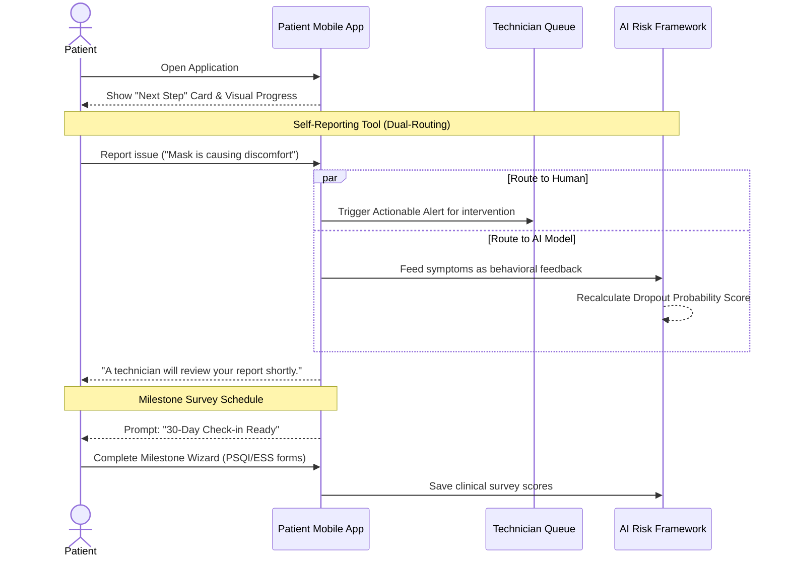
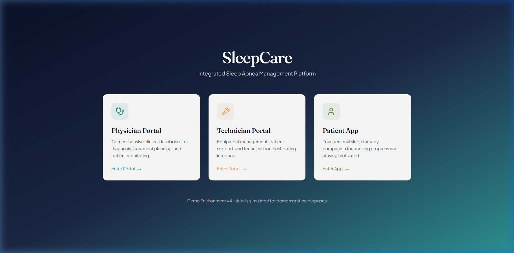
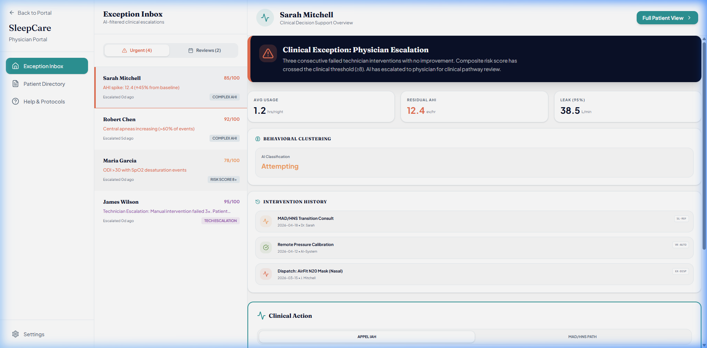
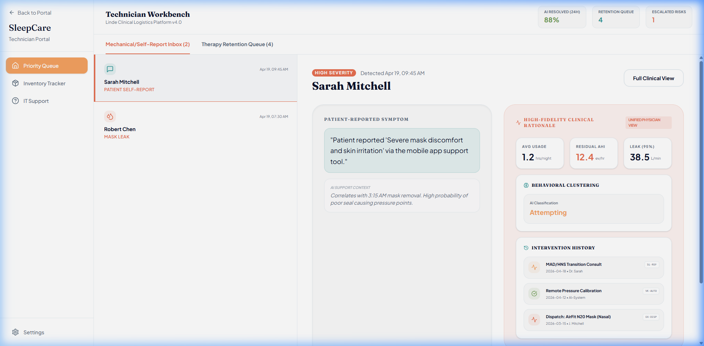
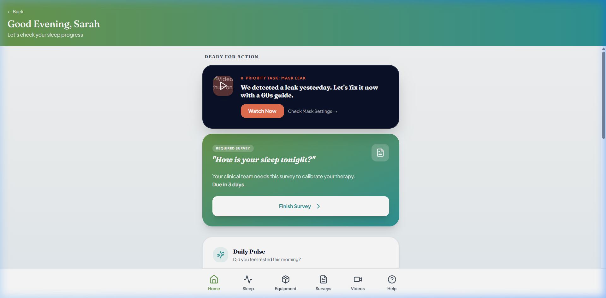

# Internship Progress Report

**Student:** Moeez Ahmed  
**Date:** April 26, 2026  
**Internship Topic:** SleepCare — Integrated Sleep Apnea Management Platform  
**Host Organization:** DISP Lab (University of Lyon 2)

## 1. Supervisor Information
*   **Name:** Yasaman Kakaei Siahkal
*   **Role:** PhD Researcher / Project Supervisor
*   **Email:** [yasaman.kakaei-siahkal@univ-lyon2.fr](mailto:yasaman.kakaei-siahkal@univ-lyon2.fr)

## 2. Project Context & Objectives
**SleepCare** is a digital health platform designed to improve therapy success for patients with **Obstructive Sleep Apnea (OSA)**. 

OSA is a condition where breathing stops during sleep, leading to serious health risks if untreated. While CPAP therapy is effective, many patients stop using it ("dropout") due to technical or comfort issues. SleepCare aims to solve this by:
*   **Predicting Dropout:** Using AI and digital biomarkers (HRV, SpO2) to identify at-risk patients early.
*   **Improving Coordination:** Providing tailored dashboards for Physicians, Technicians, and Patients to ensure faster intervention when issues arise.

## 3. Achievements to Date
I have completed the first phase of the internship and started the development phase.

### Phase 1: Requirements & Design (Weeks 1–4)
*   **Research:** Studied academic papers on sleep apnea therapy and digital biomarkers (Weeks 1–2).
*   **Stakeholder Meetings:** Worked with Yasaman and the backend intern to define the features needed for each user role.
*   **UI/UX Design:** Created high-fidelity wireframes for the role-based dashboards and specialized tabs.
*   **API Strategy:** Collaborated with the backend intern to define API contracts and data formats for the dashboards (Week 4).

### Phase 2: Core Development (Starting - Week 5)
*   **Project Setup:** Initialize the React project with TypeScript and Tailwind CSS.
*   **Functional Design:** Define screen logic and component inventory.
*   **Mock Integration:** Connect to the backend intern's mock API for component development.

## 4. Upcoming Schedule
The following tasks are planned for the next phases:

*   **Week 5:** Initialize the React + TypeScript project and set up the mock API environment.
*   **Weeks 6–13:** Build core tabs (AHI trends, Biomarkers, Interventions, Surveys) and AI monitoring panels.
*   **Week 13:** Deliver a full working prototype demo.
*   **Phase 3 (Weeks 14-18):** **AI Integration**.
    *   Add advanced patient history views for physicians.
    *   Create visit preparation cards for technicians.
    *   Implement alerts for low-confidence AI data.
*   **Phase 4 (Weeks 19-21):** **Testing & Optimization**.
    *   Test usability with technicians and improve performance.
*   **Phase 5 (Weeks 22-24):** Final documentation and report submission.

## 5. Challenges Faced
*   **Data Handling:** Combining data from different hardware brands (ResMed, Withings, etc.) into a single, clean interface.
*   **Information Design:** Designing the physician dashboard to show critical alerts without overwhelming them with too much data.
*   **API Alignment:** Working closely with the backend intern to ensure the frontend handles data gaps or sensor errors correctly.

## 6. System Diagrams

### Use Case Diagram
This diagram shows how different users interact with the SleepCare platform.

### Sequence Diagrams

#### Physician Workflow
Shows the process of monitoring critical alerts and authorizing new treatments.

#### Technician Workflow
Shows how technicians prepare for and log patient visits.

#### Patient Workflow
Shows how patient feedback updates both the technician and the AI risk model.

---

## 7. UI Snapshots

#### Role Selector Page

#### Physician Portal Dashboard

#### Technician Portal Dashboard

#### Patient Portal Dashboard

