# Research Framework: Role-Based Clinical Dashboard System for CPAP Therapy Management

**Conference:** SIME 2026 — Smart Innovations for Medicine and Engineering
**Author:** Moeez Ahmed
**Affiliation:** DISP Lab Internship

---

## 1. Research Framework Architecture

```mermaid
flowchart TD
    %% Academic Style Formatting
    classDef main fill:#1e3a8a,stroke:#1e40af,color:#ffffff,font-weight:bold,stroke-width:2px,rx:5px,ry:5px
    classDef section fill:#f8fafc,stroke:#cbd5e1,color:#0f172a,stroke-width:2px,rx:5px,ry:5px
    classDef item fill:#ffffff,stroke:#e2e8f0,color:#334155,stroke-width:1px
    classDef highlight fill:#eff6ff,stroke:#3b82f6,color:#1d4ed8,stroke-width:2px
    classDef alert fill:#fef2f2,stroke:#ef4444,color:#b91c1c,stroke-width:1px

    Title(["Role-Based Clinical Dashboard Architecture<br>(Frontend & Backend Parity)"]):::main

    subgraph Problem ["1. Problem Statement (Clinical & Technical)"]
        direction LR
        P1["Information Asymmetry<br>& Data Silos"]:::alert
        P2["Fragmented Multi-Vendor<br>Hardware APIs"]:::alert
        P3["Lack of Real-Time<br>Clinical Data Parity"]:::alert
        P4["High Therapy Dropout"]:::alert
    end

    subgraph Objectives ["2. Engineering Objectives"]
        direction LR
        O1["Design Full-Stack<br>Role-Based UI"]:::item
        O2["Establish Universal<br>API Contracts"]:::item
        O3["Integrate Biomarker<br>Hardware APIs"]:::item
        O4["Implement Frontend<br>AI Triage Interfaces"]:::item
    end

    subgraph Architecture ["3. Dashboard System Architecture"]
        direction TB
        subgraph Frontend ["Frontend Layer (React/Vite)"]
            direction LR
            UI1["Physician Exception Inbox<br>(Master-Detail UI)"]:::highlight
            UI2["Technician Triage<br>Workbench"]:::highlight
            UI3["Patient Mobile-First<br>Interface"]:::highlight
        end
        subgraph Backend ["Backend & Data Layer"]
            direction LR
            B1["Universal Truth<br>Clinical API"]:::item
            B2["Multi-Vendor Sensor<br>Data Ingestion"]:::item
            B3["AI Risk Engine &<br>Event Dispatcher"]:::item
        end
        Frontend <-->|RESTful API Contracts| Backend
    end

    subgraph Contributions ["4. Expected SIME Contributions"]
        direction LR
        C1["Scalable Framework for<br>Medical Dashboards"]:::item
        C2["Seamless Clinical Data<br>Synchronization"]:::item
        C3["Technical Blueprint for<br>Interventions"]:::item
        C4["Bridging the Engineering-<br>Medicine Gap"]:::item
    end

    %% Logical Flow
    Problem --> Title
    Title --> Objectives
    Objectives --> Architecture
    Architecture --> Contributions
```

---

## 2. Problem Statement (Clinical & Technical)

The management of CPAP therapy suffers from a critical engineering and clinical disconnect. From a clinical perspective, high dropout rates (30–50%) persist because interventions are reactive. From an **engineering perspective**, this is fundamentally a data silo problem:
- **Fragmented Hardware APIs:** Patient data originates from multiple, disconnected wearable hardware ecosystems (Hexoskin, Masimo, Withings).
- **Information Asymmetry:** Physicians, technicians, and patients do not share the same "State" or "View" of the data due to a lack of a unified dashboard layer.
- **Lack of Backend Parity:** Current systems lack a unified "Universal Truth" API contract, meaning UI layers cannot synchronize reliably across different clinical roles.

---

## 3. Engineering Objectives

This research focuses on the software architecture required to solve this asymmetry:
1. **Design a Full-Stack Role-Based UI Architecture:** Build distinct frontend portals for Physicians, Technicians, and Patients that consume the same unified state.
2. **Establish Universal API Contracts:** Define strict RESTful contracts to ensure backend parity across all frontend dashboards.
3. **Integrate Biomarker Hardware APIs:** Construct a robust backend ingestion pipeline to normalize physiological data from multi-vendor sensors.
4. **Implement Frontend AI Triage Interfaces:** Create human-in-the-loop validation UIs that allow clinical staff to interact with AI-generated risk scores and event flags.

---

## 4. Dashboard System Architecture

The core of this framework is a decoupled architecture separating the presentation layer from the clinical data layer:

### 4.1 Frontend Layer (React/Vite)
A single-page application (SPA) architecture utilizing a shared component library to guarantee UI consistency.
- **Physician Dashboard:** Features a master-detail layout optimized for rapid 2-minute clinical reviews of AI-escalated exceptions.
- **Technician Workbench:** A high-throughput triage queue for managing mechanical alerts and processing patient support tickets.
- **Patient Mobile Interface:** A responsive, simplified UI focused on gamified daily engagement (streaks, ring charts) and trigger-based video delivery.

### 4.2 Backend & Data Layer
- **Universal Truth Clinical API:** A single authoritative API schema that serves synchronized data (CPAP trends, biomarkers, surveys) to all three portals simultaneously.
- **Multi-Vendor Sensor Ingestion:** Backend microservices responsible for pulling and normalizing data from manufacturer APIs (e.g., Hexoskin HRV, Masimo SpO2).
- **AI Risk Engine & Event Dispatcher:** A backend service that analyzes telemetry data, computes dropout risk, and dispatches validation events to the technician UI.

---

## 5. Implementation Methodology

- **Contract-First API Development:** Before any frontend implementation, API specifications (GET/POST endpoints for patient summaries, devices, interventions) are formalized to act as a strict contract between the frontend and backend teams.
- **Shared UI Component Architecture:** Designing universal React components (e.g., `UniversalBiomarkers`, `UniversalSurveys`) that are injected into role-specific layouts, ensuring that when a physician and technician discuss a case, they are looking at visually identical data representations.
- **State Management for Real-Time Sync:** Using robust frontend data fetching strategies (e.g., React Query) to maintain synchronization with the backend API and reduce staleness.

---

## 6. Expected SIME Contributions

This framework directly aligns with the **SIME 2026** theme of *Smart Innovations for Medicine and Engineering*:
1. **Scalable Framework for Medical Dashboards:** Providing a reproducible software architecture for role-based clinical systems.
2. **Seamless Clinical Data Synchronization:** Demonstrating how strict API contracts can eliminate clinical information asymmetry.
3. **Bridging the Engineering-Medicine Gap:** Using modern web technologies (React, REST APIs, UI Componentization) to directly solve a pressing medical compliance problem (CPAP adherence).

