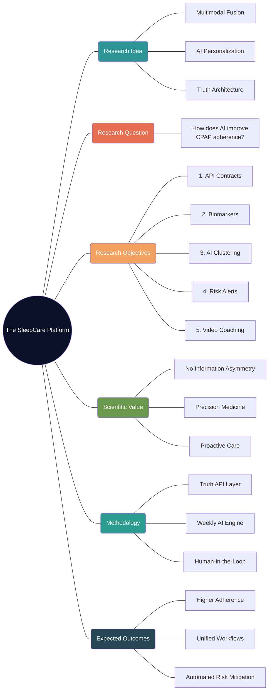

# Research Framework: The SleepCare Platform

This document outlines the core scientific structure of your paper for the **SIME 2026 Conference**, as requested by your supervisor.

## 1. Research Mind Map

## 2. Formal Research Question
**RQ:** *To what extent does a multimodal integration architecture—unifying device trends, physiological biomarkers (SpO₂, HRV, ODI), patient-reported surveys, and educational video coaching—improve the precision of AI-driven risk stratification and therapy adherence in CPAP patients?*

## 3. Scientific Research Objectives
1.  **Architecture Development:** Design and implement a "Universal Truth" API that synchronizes heterogeneous data streams (Hardware, Wearables, and Surveys) into a single weekly analysis state.
2.  **Biomarker Analysis:** Quantify the predictive power of multi-sensor physiological data (from Hexoskin, Masimo, and Somno-Art) in identifying early signs of therapy discomfort or physiological distress.
3.  **Dynamic Stratification:** Develop and evaluate an AI clustering model that dynamically categorizes patients into four clinical clusters (*Adherent, Attempting, Struggling, Dropout*) based on evolving data patterns.
4.  **Operational Validation:** Validate a real-time "Technician Priority Queue" that uses AI-driven risk scores to enable proactive rather than reactive clinical interventions.
5.  **Engagement Evaluation:** Measure the efficacy of educational video interventions as a trigger-based clinical tool for improving long-term patient compliance.

## 4. Problem Statement & Motivation
*   **The Problem:** Current CPAP therapy suffers from a "Data Silo" problem where device usage, patient feelings, and physiological vitals are stored in separate, unlinked systems.
*   **The Result:** High therapy dropout rates (30-50%) because clinical teams detect issues too late.
*   **The Innovation:** The SleepCare platform closes this loop by providing a unified "Clinical Cockpit" for both Physicians and Technicians, powered by an AI engine that looks at the *whole* patient, not just the machine.

---

> [!TIP]
> **Presentation Tip:** When presenting this to your supervisor, highlight that your mind map covers both the **Technical Engineering** (API contracts/Architecture) and the **Clinical Science** (Adherence/Biomarkers). This balance is what SIME 2026 looks for.
