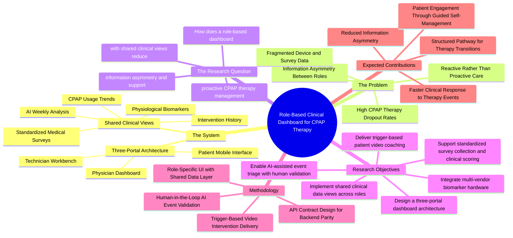

# Research Framework: Role-Based Clinical Dashboard System for CPAP Therapy Management

**Conference:** SIME 2026 — Smart Innovations for Medicine and Engineering
**Author:** Moeez Ahmed
**Affiliation:** DISP Lab Internship

---

## 1. Research Mind Map

```mermaid
mindmap
  root((Role-Based Clinical Dashboard for CPAP Therapy))
    The System
      Three-Portal Architecture
        Physician Dashboard
        Technician Workbench
        Patient Mobile Interface
      Shared Clinical Views
        CPAP Usage Trends
        Physiological Biomarkers
        Standardized Medical Surveys
        AI Weekly Analysis
        Intervention History
    The Problem
      Information Asymmetry Between Roles
      Fragmented Device and Survey Data
      Reactive Rather Than Proactive Care
      High CPAP Therapy Dropout Rates
    The Research Question
      How does a role-based dashboard
      with shared clinical views reduce
      information asymmetry and support
      proactive CPAP therapy management
    Research Objectives
      Design a three-portal dashboard architecture
      Implement shared clinical data views across roles
      Integrate multi-vendor biomarker hardware
      Enable AI-assisted event triage with human validation
      Deliver trigger-based patient video coaching
      Support standardized survey collection and clinical scoring
    Methodology
      Role-Specific UI with Shared Data Layer
      API Contract Design for Backend Parity
      Human-in-the-Loop AI Event Validation
      Trigger-Based Video Intervention Delivery
    Expected Contributions
      Reduced Information Asymmetry
      Faster Clinical Response to Therapy Events
      Structured Pathway for Therapy Transitions
      Patient Engagement Through Guided Self-Management
```

---

## 2. Problem Statement

CPAP therapy for obstructive sleep apnea suffers from dropout rates of 30–50% within the first year. A central cause is that the stakeholders involved in a patient's care—physicians, clinical technicians, and the patients themselves—each operate with incomplete information:

- **Physicians** see clinical summaries and survey scores but lack visibility into day-to-day equipment issues, mask fit problems, or technician field observations.
- **Technicians** handle logistics and patient contact but cannot see the physician's clinical reasoning, AI risk assessments, or survey-derived clinical scores.
- **Patients** receive therapy equipment but have limited understanding of their own data, no structured educational guidance, and no clear channel to report symptoms back to their care team.

This **information asymmetry** means that problems are detected late, interventions are reactive, and the patient's subjective experience is disconnected from the clinical record.

---

## 3. Research Question

> *How does a role-based dashboard architecture—where physicians, technicians, and patients share a common clinical data layer encompassing device usage trends, physiological biomarkers, standardized medical surveys, AI-driven risk analysis, and educational video coaching—reduce information asymmetry and support proactive management of CPAP therapy?*

---

## 4. Research Objectives

### Objective 1: Design a Three-Portal Dashboard Architecture
Build a web-based system with three distinct portals, each tailored to its user's clinical role and operational context:
- **Physician Portal:** An "Exception Inbox" that surfaces only AI-escalated urgent cases and overdue annual reviews, with a master-detail layout for rapid 2-minute clinical review.
- **Technician Portal:** A "Workbench" split between a Mechanical/Self-Report Event Inbox (for AI-flagged anomalies requiring human validation) and a Therapy Retention Queue (sorted by dropout risk, behavioral cluster, and geographic region).
- **Patient Portal:** A mobile-first interface centered on daily engagement—last night's usage ring, streak tracking, survey completion prompts, and trigger-based coaching video delivery.

### Objective 2: Implement Shared Clinical Data Views Across Roles
Ensure that physicians and technicians access the same underlying patient data through four shared views:
- **CPAP Trends:** Usage hours, AHI, leak percentile, pressure settings, 30-day trend charts, and compliance streaks.
- **Biomarker Monitoring:** Seven biomarker channels (ODI, HRV, SpO₂, Respiratory Effort Variability, Obstructive Apnea Index, Deep Sleep Duration, Blood Pressure) each attributed to its hardware source (Hexoskin, Masimo, Somno-Art, Withings).
- **Medical Surveys:** Six standardized instruments (ESS, PSQI, ISI, FSS, SF-36, BDI) with itemized patient responses, clinical threshold breach detection, and interpretive clinical notes. For technicians, this view also includes an operational monitoring desk for logging Mask Comfort & Fit Checks, Hardware Integrity Logs, and Hygiene Reviews.
- **AI Weekly Analysis:** Composite risk score (0–100), predicted days to dropout, AI confidence level, therapy phase, dynamic cluster assignment (Adherent → Attempting → Struggling → Dropout), 7-day rolling metrics, risk factor breakdown with directional indicators, and a "Next Best Action" recommendation.

### Objective 3: Integrate Multi-Vendor Biomarker Hardware
Support a manufacturer-agnostic sensor ecosystem where each biomarker is transparently sourced:
- Hexoskin Smart Shirt → HRV, Respiratory Effort Variability (RVO)
- Masimo MightySat Rx → SpO₂, ODI
- Somno-Art Band → Sleep Architecture (Deep Sleep / N3), OAI
- Withings BPM Core → Blood Pressure, AFib detection
- Withings ScanWatch → Sleep, HR, SpO₂, Activity

The technician portal includes a dedicated "Biomarker Devices" management view showing each device's connection status, battery level, last sync time, and pairing controls.

### Objective 4: Enable AI-Assisted Event Triage with Human Validation
Implement a "Human-in-the-Loop" protocol for AI-flagged clinical events:
- The AI detects anomalies from device data (Mask Leak, Usage Drop, Missed Nights, Equipment Alert) and patient self-reports.
- Each event appears in the Technician's inbox with severity classification, an evidence package, and an AI-generated analysis note.
- The technician must either **Validate** (confirming the event and unlocking intervention actions) or **Dismiss** (providing a mandatory written reason, e.g., "false positive due to data anomaly").
- Validated events, along with their full clinical rationale, are visible in the Physician's Exception Inbox for downstream clinical decision-making.

### Objective 5: Deliver Trigger-Based Patient Video Coaching
Provide patients with educational video content that is contextually relevant to their current therapy status:
- Videos are categorized (Mask & Equipment, Tips & Tricks, Maintenance, Understanding Your Data, Lifestyle) and filtered by clinical relevance.
- High-relevance videos are surfaced as "Recommended for You" with trigger reasons (e.g., "Mask Leak Detected").
- Urgent videos can be delivered as modal interventions on the patient's home screen, assigned by the care team.
- Engagement is tracked (watched status, star rating, watch duration) and fed back into the clinical record.

### Objective 6: Support Standardized Survey Collection and Clinical Scoring
Integrate patient-reported outcome measures as a formal data channel:
- Six validated instruments (ESS, PSQI, ISI, FSS, SF-36, BDI) are presented with itemized responses and clinical threshold breach alerts.
- Survey completion is actively managed through automated follow-up reminders, progress tracking, and overdue escalation to technicians.
- The patient portal presents surveys as persistent action items with progress bars and due dates.

---

## 5. Methodology

### 5.1 System Architecture
The dashboard is built as a single-page React application (Vite + TypeScript) using a shared component architecture. Role-specific layouts (`PhysicianLayout`, `TechnicianLayout`, `PatientLayout`) provide navigation and context, while shared views (`UniversalBiomarkers`, `UniversalSurveys`, `UniversalInterventions`, `UniversalAIAnalysis`) ensure data parity.

### 5.2 API Contract Design
A set of RESTful API contracts defines the "Universal Truth" data layer—the single authoritative schema that all three portals consume. These contracts specify:
- **GET endpoints** for patient summary, physician/technician queues, CPAP trends, biomarkers, devices, interventions, surveys, AI weekly state, and video content.
- **POST endpoints** for technician event triage, monitoring log submission, intervention creation, clinical pathway authorization, video engagement tracking, survey submission, and patient support tickets.

This contract-first approach means the frontend dashboards are designed and validated independently of backend implementation, ensuring architectural clarity.

### 5.3 Intervention Cockpit
The system provides a unified "Intervention Viability History" visible to both physicians and technicians. Physicians can issue formal clinical orders or authorize therapy transitions (MAD/HNS pathways with digital seal). Technicians can log field interventions (Equipment Dispatch, Remote Call, Home Visit, Pressure Adjustment). All actions are recorded in a shared registry with actor attribution, outcome tracking, and job codes.

### 5.4 Human-in-the-Loop Validation
AI-flagged events require explicit human validation before they trigger clinical workflows. This design decision prioritizes clinical safety over automation speed: no AI-generated alert reaches a physician without first being reviewed by a technician who can assess ground-truth context.

---

## 6. Expected Contributions

1. **Architectural:** A replicable three-portal dashboard pattern for role-based clinical systems that maintains data parity through shared views and a contract-first API design.
2. **Clinical:** Evidence that shared clinical visibility (where technicians and physicians see the same biomarker trends, survey scores, and AI analysis) enables faster, more coordinated interventions.
3. **Methodological:** A documented Human-in-the-Loop protocol for AI event triage in remote patient monitoring, balancing automation efficiency with clinical accountability.
4. **Behavioral:** A trigger-based video coaching system as a structured behavioral intervention channel, with engagement metrics integrated into the clinical feedback loop.

---

## 7. Alignment with SIME 2026

This work sits at the intersection of **Medicine** (CPAP adherence, clinical surveys, biomarker monitoring) and **Engineering** (dashboard architecture, API design, AI-assisted triage). The SIME conference theme of "Smart Innovations for Medicine and Engineering" directly maps to our contribution: using software engineering principles (role-based access, contract-first APIs, shared component architecture) to solve a clinical problem (information asymmetry in chronic therapy management).
